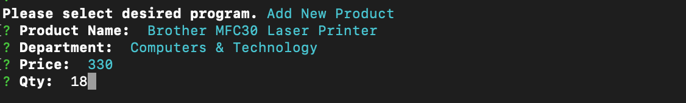

# Bamazon
## A Command-Line Online Store and Sales Database

### Overview
This project is designed to emulate an Amazon-like storefront using MySQL, node.js, and a handful of common npm node modules. The simple command-line app allows customers to easily browse all inventory items, place an order for an item, and if it's in stock with get a confirmation and calculated total cost. Plus, any successful order automatically update that product's inventory level in the MySQL database to prevent potential over selling to other users. Additionally, managers have a completly different list of commands that they can use to restock items in the database, add new products, or even run a report to find prodcuts with low stock quantities.
- - -
## Dependences
As this project only uses a command-line interface and a locally deployed MySQL server, there is no "hosted version" of this app for easy live-demo. Therefore, if you would like to test or use this code on your own, you will first need the following dependencies:

1. Step One: Install node.js
  Required NPM Node Modules:
   * [Node](https://www.npmjs.com/package/node) - for back-end command-line javascript interface.

   * [mysql](https://www.npmjs.com/package/mysql) - for the ability for node to directly recieve and send data to a MySQL database.

   * [require](https://www.npmjs.com/package/require) - used to allow command-line prompts and list menus for choice selection.

   Once node is installed on you computer and you have downloaded or forked a copy of these code files, you then need to use terminal to navigate to your project folder and type the command:

            npm install
  
   This will automatically install the required 'mysql', and 'require' modules respectively. For more details on installing node modules see: https://docs.npmjs.com/cli/install

2. Step Two: Get MySql Tools (if you don't already have one)
  
    You may want to use something like MySQLWorkBench to create and locally deploy your own copy of the bamazon MySQL enviorment.
    * [MySqlWorkBench](https://dev.mysql.com/downloads/workbench/) - a great fee tool for Windows, Mac, or Linux that allows you to create, edit, test, or locally host MySQL databases.
    * [Documentaion](https://dev.mysql.com/doc/workbench/en/) - their documentation if you get stuck on how to setup or use MySqlWorkBench. In setting up you will be asked to create a root password REMEMBER THIS as you will need it in the javascript files to connect properly.

3. Step Three: Set up MySQL
    
    Now that you have MySqlWorkBench (or an equivalent) installed you can now use the 'bamazon.sql' code to create the simple database, table and column names used in this project.

    The subsequent code from the 'products_seed.sql' file can then be used to quickly insert some 'dummy' data your new locally hosted database.

4. Step Four: Enjoy!
  
   Ok, maybe this isn't a dependency but it sure never hurts :)
- - -
## Instructions

There are two main javascript files that run this app: 'bamazonCustomer.js' for the customer experience and 'bamazonManager.js' for the manager view and commands.

### bamazonCustomer.js
1. While navigated to the project folder within you terminal, simply enter the following command to start the customer file:

            node bamazonCustomer.js

This will show you a list of all the current products available from the bamazon database. Depending on the number of items available, you may need to scroll up to view them all.

2. When you find a product that you would like to order simply enter the desired Product ID in the command-line prompt and press ENTER on your keyboard

This will then promt you to enter your desired order quantity

If successful, you will see a prompt showing you your order total, as well as notifying you of the now updated product inventory status.

If an order can not be completed due to insufficent inventory, the user will be notified and the DATABASE quantity does not get altered.

Each function within both javaascript files of the app triggers a 'return to main menu' command so the user can continue to use the app multiple times without needing to constantly quit and restart it. If they choose 'No' then the database connection gets closed and the app simply ends.

- - -

### bamazonManager.js

1. Like the bamazonCustomer.js file, simply enter the following command to start the Manager file:

            node bamazonManager.js

### Here you will see a menu of four manager-specific app commands:

### 1. View All Products - will list all products by ID, their Name, and their respective stock quantity

### 2. Run Restock Report - will query the database for all products whose stock quantity is 5 units or less
    

### 3. Receive Inventory - will allow the manager to input recieved restock items of existing products so the database quantities are correct.

    * First it will list all products
  

    * Then the manager enters the desired Product Id
  

    * Then the received quantity for the product
  

    * The new product quantity is now updated in the database
  

### 4. Add New Product - allows the manager to input completely new products to the database that didn't previously exist.

    * Enter new product name
  

    * The product department (chosen from a pre-determined value list)
  

    * Then enter the product price and starting quantity respectively
  

    * ¡Voila! A new product has been added to the database!
  

### Here is a full video demo as well just because!

  [View Demo on YouTube](https://youtu.be/WPo8RzLq2uw)
  
- - -
